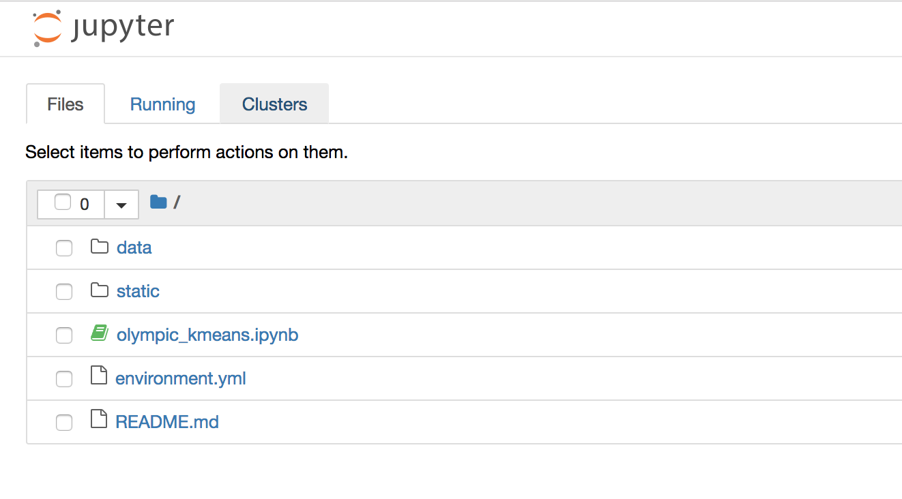

# K-Means Clustering with Python and Olympian Data

This repository contains a Jupyter notebook which can be used in a workshop about k-means clustering using the [*120 years of Olympic history: athletes and results*](https://www.kaggle.com/heesoo37/120-years-of-olympic-history-athletes-and-results) dataset available on Kaggle.

## Installation/Set-up
- You will need [miniconda](https://conda.io/miniconda.html) (or the full [anaconda](https://www.anaconda.com/download/#macos) for Python 3.7
- Clone this repo
- Using the `environment.yml` file, create a new conda environment:
`conda env create -f environment.yml`
- To activate the environment, run `source activate myenv`.
- To test that everything works, run `jupyter notebook` and navigate to `localhost:8888/` in your browser. You should see:

## Working with the Jupyter Notebook

There are two versions of this notebook:
* `olympic_kmeans.ipynb` is the full notebook, with answers
* `olympic_kmeans_follow_along.ipynb` lets you follow along, filling in the code as you go.

## Sources
- [kmean clustering algorithm short tutorial with python practice (k-mean++)](https://www.youtube.com/watch?v=8-3zON8NnkU)
- [Python: Pandas Tutorial | Intro to DataFrames](https://www.youtube.com/watch?v=e60ItwlZTKM)
