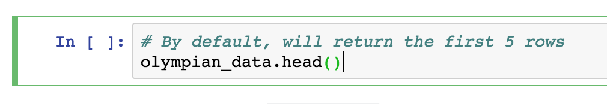
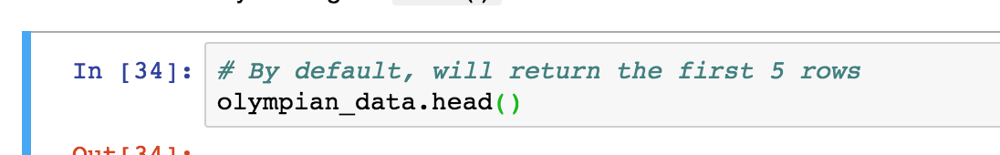

# K-Means Clustering with Python and Olympian Data

This repository contains a Jupyter notebook which can be used in a workshop about k-means clustering using the [*120 years of Olympic history: athletes and results*](https://www.kaggle.com/heesoo37/120-years-of-olympic-history-athletes-and-results) dataset available on Kaggle.

## Installation/Set-up
- You will need [miniconda](https://conda.io/miniconda.html) (or the full [anaconda](https://www.anaconda.com/download/#macos) for Python 3.7)
- Clone this repo
- Using the `environment.yml` file, create a new conda environment:
`conda env create -f environment.yml`
- To activate the environment, run `source activate myenv`.
- To test that everything works, run `jupyter notebook` and navigate to `localhost:8888/` in your browser. You should see an interface like this:

## Working with the Jupyter Notebook

There are two versions of this notebook:
* `olympic_kmeans_follow_along.ipynb` lets you follow along, filling in the code as you go.
* `olympic_kmeans.ipynb` is the full notebook, with answers if you get stuck

Click on the notebook you wish to run.

Inside each notebook are several cells. When interacting with the cells, you can either be in:

* **Edit Mode** (green border) for editing cells.  Selecting a cell and hitting ENTER will put you in Edit Mode.

* **Command Mode** (blue border) for running cells. Hitting ESCAPE on a cell in Insert Mode will put you back in Command Mode.

To run a selected cell, you can either hit the "Run" button in the top menu bar or by hitting Shift+Enter in Command Mode.

## Sources
- [kmean clustering algorithm short tutorial with python practice (k-mean++)](https://www.youtube.com/watch?v=8-3zON8NnkU)
- [Python: Pandas Tutorial | Intro to DataFrames](https://www.youtube.com/watch?v=e60ItwlZTKM)
- [Clustering Algorithms: From Start To State Of The Art](https://www.toptal.com/machine-learning/clustering-algorithms)
